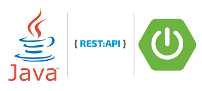

## 3. REST

* Плюсы JAX-RS: Стандарт JSR можно запускать без контейнера сервлетов (гризли, простой,...)
Готовые к использованию реализации (jersey, cxf, resteasy, restlet,...), предназначенные только для приложений REST.
* Плюсы Spring MVC: Предоставляет «полный» стек, а не только возможности REST.
Внедрение зависимостей/АОП/Транзакции Подключаемые шаблоны представлений (JSP, freemarker, Velocity, ...)

Выбрана модель данных с первой лр.

Принципы RESTful
1. Клиент-серверная архитектура: RESTful API должен быть разделен на клиентскую и серверную части, которые должны работать независимо друг от друга.

2. Без состояния: RESTful API не должен сохранять состояние между запросами. Вся информация, необходимая для обработки запроса, должна быть передана клиентом в каждом запросе.

3. Кэширование: RESTful API должен поддерживать кэширование ответов для уменьшения количества запросов к серверу.

4. Единообразие интерфейса: RESTful API должен иметь единообразный интерфейс, который позволяет клиентам взаимодействовать с API без необходимости знать внутреннюю структуру системы.

5. Слои: RESTful API должен быть построен с использованием слоев, которые могут обеспечить безопасность, надежность и масштабируемость.

6. Код по требованию: RESTful API должен поддерживать возможность передачи кода на выполнение на стороне клиента.

Available headers
\
application/xml / application/json

В данной работе разработано XSL-преобразование для XML объектов, чтобы в браузере были отображения их в виде HTML-страниц.
Добавлено XSLT ко всем XML-ответом, добавлена навигация по таблицам.