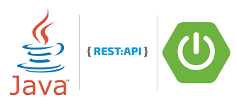

## 3. REST

* Плюсы JAX-RS: Стандарт JSR можно запускать без контейнера сервлетов (гризли, простой,...)
Готовые к использованию реализации (jersey, cxf, resteasy, restlet,...), предназначенные только для приложений REST.
* Плюсы Spring MVC: Предоставляет «полный» стек, а не только возможности REST.
Внедрение зависимостей/АОП/Транзакции Подключаемые шаблоны представлений (JSP, freemarker, Velocity, ...)